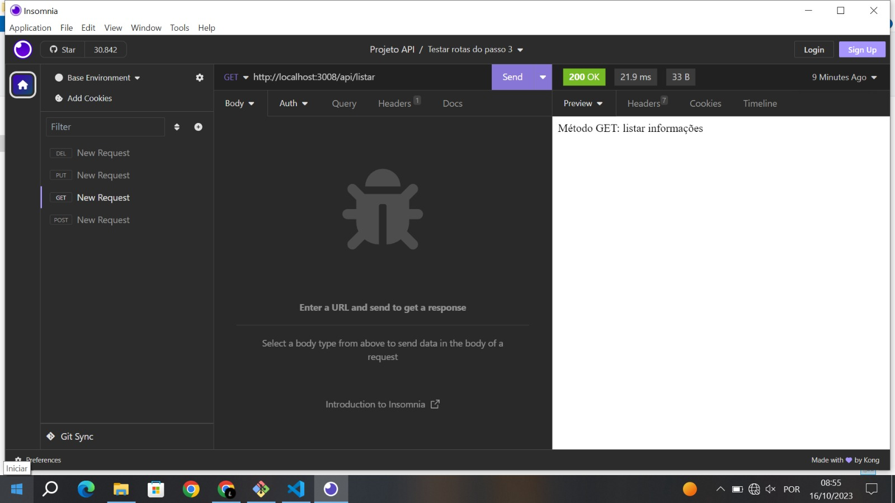
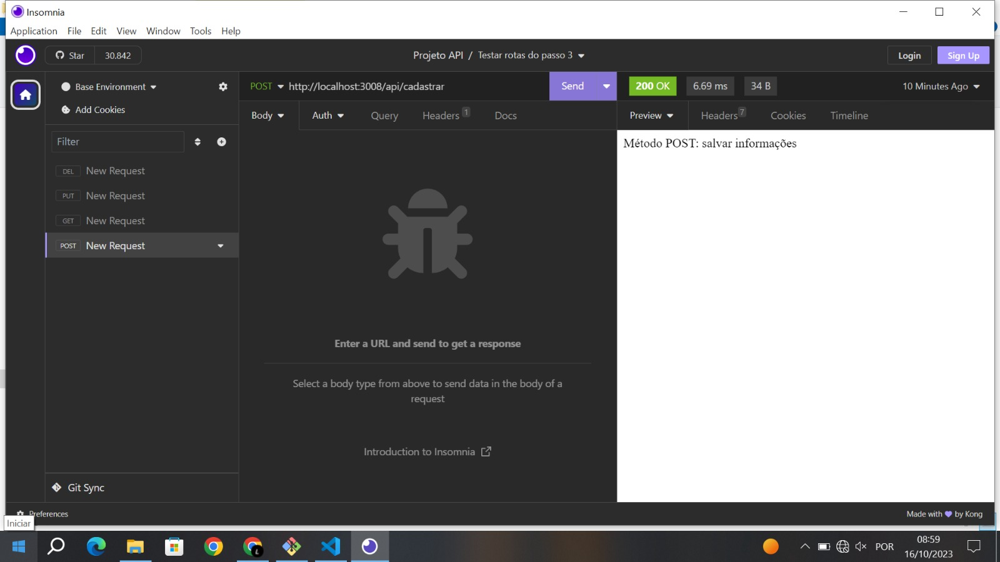
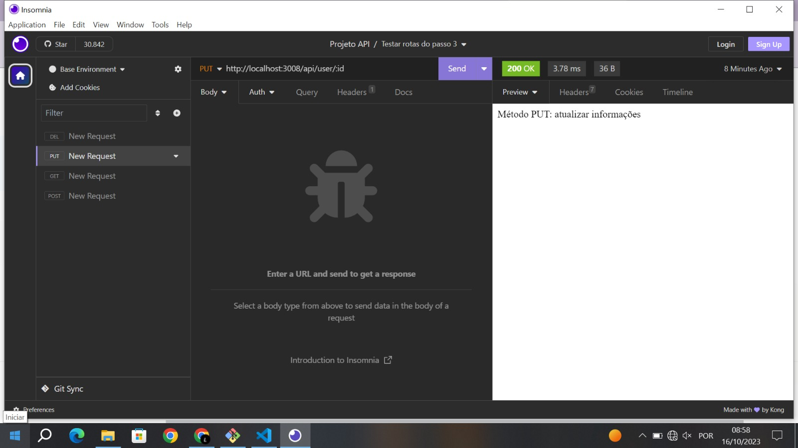
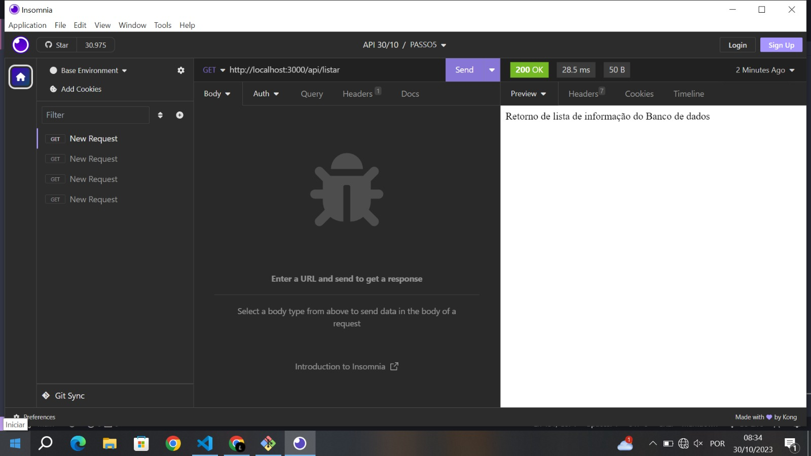
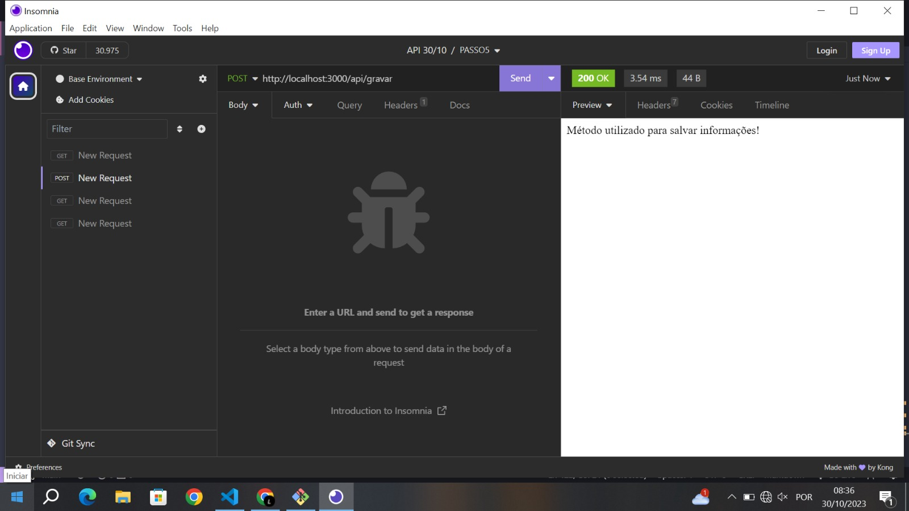

# PASSO 1 

criar pasta
```
mkdir NOME_PASTA
```
acessar pasta
```
cd NOME_PASTA
```
criar arquivos para documentar projeto
```
touch readme.md
```
iniciar o gerenciadro de pacotes Node
```
npm init -y
```
instalar os pacotes
```
npm i express nodemon dotenv
```
abrir o vscode
```
code . 
```
criararquivo .gitignore
```
nano .gitignore
```
Adicionar no arquivo .gitignore o nome da pasta criada após a instalação dos pacotes
* Ctrl + o: Salvar o arquivo
* Enter
* Ctrl + x: Fechar o arquivo
```
node_modules
```
Criar estrutura de arquivos e pastas
```
mkdir src
```
Criar arquivos dentro da pasta src
```
touch src/app.js
```
```
touch src/server.js
```
```
mkdir src/config
```
```
mkdir src/controllers
```
```
mkdir src/routes
```
Inicializar o gerenciador de arquivos
```
git init
```
Informar nome e email 
```
git config --global user.name "FIRST_NAME"
```
```
 git config --global user.email "EMAIL@EXAMPLE.COM"
```
verificar arquivos 
```
git status 
```
adicionar arquivos 
```
git add .
```
salvar e escrever comentário
``` 
git commit -m 'estrutura do projeto'
```
- criar repositório no GitHub
- clicar no icone de copiar o URL do repositório

definir a branch main
```
git branch -M main
```
colar a URL 
```
git remote add origin COLAR_URL
```
enviar para o GitHub
```
git push -u origin main
```

# PASSO 2

Copiar a url do projeto
* Acessar repositório do projeto no gitHub
* Clicar no botão verde '<> Code'
* Clicar no ícone para copiar a URL, conforme a imagem

Abrir o gitBash 
```
git clone URL_REPOSITORIO
```

Acessar a pasta 
```
cd NOME_REPOSITORIO
```

Reinstalar os apcotes da aplicação
```
cd NOME_REPOSITORIO
```

Criar arquivo .env 
```
nano .env
```
Digitar no arquivo .env
```
PORT = 3008
```

* Ctrl + o: Salvar o arquivo
* Enter: Confirmar
* Ctrl + x: Fechar o arquivo

Adicionar arquivo .env no .gitignore
```
nano .gitignore
```
```
.env
```

Abrir VSCode
```
code .
```

Criar arquivo de exemplo para para as variáveis necessárias da aplicação
```
nano .env.example
```

Adicionar no arquivo .env.example
```
PORT = 
```

Abrir o arquivo app.js e digitar o código


* Importar o pacote express (servidor)
```
const express = require('express');
```
* Importar o pacote dotenv, gerenciador de variáveis de ambiente
```
const dotenv = require('dotenv').config();
```
* Instanciar o express na variável app
```
const app = express();
```
* Setar a porta do servidor a partir do arquivo .env
* O operador condicional '||' significa 'OU', caso não tenha a variável PORT, será utilizado o valor '3333'
```
app.set('port', process.env.PORT || 3333);
```
*  Exportar as configurações na variável app
```
module.exports = app;
```

Abrir o arquivo server.js e digitar os códigos
* Importar o arquivo app
```
const app = require('./app');
```
* Importar a porta do servidor
```
const port = app.get('port');
```
* Testar API com a função listen
* 1º parâmetro: passamos a porta do servidor
* 2º parâmetro: arrow function para retornar um console informando a porta que está rodando o servidor
```
app.listen(port, () => {
    console.log(`Running on port ${ port }!`);
});
```


Abrir o arquivo package.json e alterar a chave 'scripts'
* Substituir o comando 'test' pelo comando 'start' na linha 7
```
"start":"nodemon src/server.js"
```

Rodar o comando no termial com gitBash
```
npm run start
```

Atualizar projeto no gitHub
* Adicionar todos arquivos ao versionamento
```
git add .
```
* Salvar projeto e escrever comentário sobre o processo realizado
```
git commit -m 'configuração do projeto'
```
* Enviar os arquivos atualizados para o gitHub
```
git push
```

# PASSO 3 

Copiar a URL do projeto no GitHub

Clonar o repositório na sua máquina 
```
git clone URL_REPOSITORIO
```
Acessar pasta
```
cd NOME_REPOSITORIO
```
Reinstalar os pacotes da aplicação
```
npm i
```
Criar pastas dentro da pasta src
```
mkdir src/routes
```
Criar arquivo dentro da pasta routes
```
touch src/routes/rotas.js
```
Abrir o VSCode
```
code .
```


Abrir o arquivo rotas.js e digitar os códigos
```
// Importar o modulo de Router do express
const { Router } = require('express');

// Instanciar o Router na variável router
const router = Router();

router.get('/listar', (request, response) => {
    response.send('Método GET: listar informações');
});
router.post('/cadastrar', (request, response) => {
    response.send('Método POST: salvar informações');
});
router.put('/user/:id', (request, response) => {
    response.send('Método PUT: atualizar informações');
});
router.delete('/user/:id', (request, response) => {
    response.send('Método DELETE: remover informações');
});

module.exports = router;
```
Abrir o arquivo app.js e adicionar o código
```
const router = require('./routes/rotas');
```
* Esta linha deve inserida depois da criação da variável app
```
app.use('/api', router);
```
Atualizar projeto no gitHub
```
git add .
```
```
git commit -m 'rotas do projeto'
```
```
git push
```

# PASSO 4
* Abrir o gitBash em um local do computador
* Digitar o comando 'git clone' junto com a URL do seu repositório
```
git clone URL_REPOSITORIO
```

Acessar pasta 
```
cd NOME_REPOSITORIO
```


Reinstalar os pacotes da aplicação
```
npm i
```

Recriar arquivo .env
```
nano .env
```
Digitar no arquivo .env
```
PORT = 3008
```

* Ctrl + o: Salvar o arquivo
* Enter: Confirmar
* Ctrl + x: Fechar o arquivo

## Insomnia
* Abrir no Computador
* Clicar no ícone "+"
* Defina o nome do projeto e clique no botão 'Create'
* Clique no botão 'New Collection'
* Defina o nome da coleção e clique no botão 'Create'
* Clique no botão 'New HTTP Request'

* Agora só precisamos descrever a url da nossa API com a porta que definimos (http://localhost:3000) e as rotas (/api/listar) que criamos no arquivo rotas.js do passo 3

####  ATENÇÃO
Antes de clicar no botão 'Send' para executar a ação da rota, execute o comando 'npm start' no seu projeto para rodar a API e verifique se o retorno estará conforme a imagem a seguir, ou seja, rodando na porta definida para o servidor

- Após validar que a API esta rodando, executa a ação da rota clicando no botão 'Send'
- O Insomnia deverá retornar a mensagem descrita no método GET do nosso arquivo de rotas

GET 


POST


PUT


DELETE


# PASSO 5
* Clonar o repositório 
```
git clone URL_REPOSITORIO
```

* Acessar a pasta
```
cd NOME_REPOSITORIO
```
* Reinstalar os pacotes da aplicação
```
npm i
```
* Recriar arquivo .env e colocar: 
```
PORT = 3000
```
* Criar pasta 'controllers' dentro da pasta 'src'
```
mkdir scr/controllers
```
* Criar arquivo 'crudController.js' na pasta 'controllers'
```
touch src/controllers/crudController.js
```
* Colar os códigos no arquivo crudController.js
```
function listarDados(request, response) {
    response.send('Retorno de lista de informação do Banco de dados');
}

function gravarDados(request, response) {
    response.send('Método utilizado para salvar informações!');
}

function atualizarDados(request, response) {
    response.send('Método utilizado para editar informações!');
}

function deletarDados(request, response) {
    response.send('Método utilizado para deletar informações!');
}

module.exports = {
    listarDados,
    gravarDados, 
    atualizarDados, 
    deletarDados
}
```
* Alterar o arquivo 'rotas.js'
```
// Importar pacote do express
const { Router } = require('express');
// Instanciar o Router na variavel router
const router = Router();
// Importar funções do controller para a rota acessar as funções
const { 
    listarDados,
    gravarDados,
    atualizarDados,
    deletarDados
 } = require('../controllers/crudController');

router.get('/listar', listarDados);

router.post('/gravar', gravarDados);

router.put('/atualizar/:id', atualizarDados);

router.delete('/deletar/:id', deletarDados);

module.exports = router;
```
GET 


POST


PUT


DELETE

